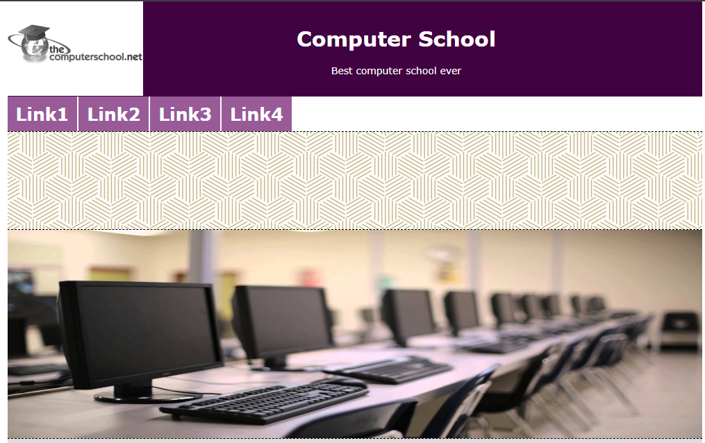
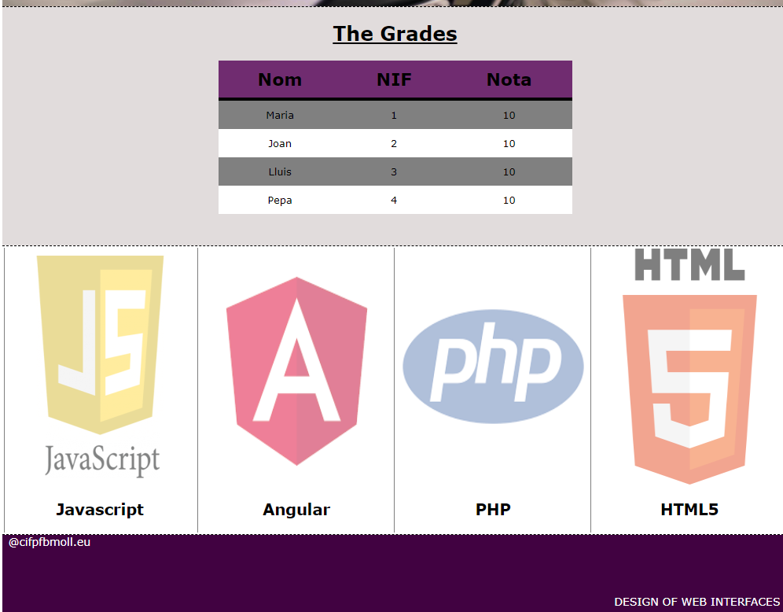

# Ejercicios Diseño Interfaces Web

## Ej.1.1-Coffe

Se situa un ejercicio básico introductorio de html y css sobre una cafetería.

## Ej 1.2-Position

Se situa un ejericio de posicionamiento de elementos en la página web.

## Ej 1.3-ComputerSchool

Se posiciona un trabajo para la imitación de una página web con una serie de elementos y requisitos,
aquí se utiliza tanto html como css e inserción de imagenes.

El resultado final:

